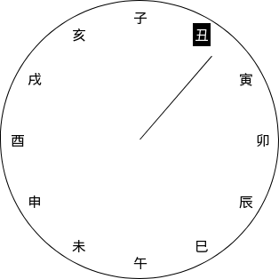

# chinese-clock

Hosted on https://chinese-clock.surge.sh

**Timeslot Naming:**

| Name | Range   |
| ---- | ------- |
| 子   | 23 - 1  |
| 丑   | 1 - 3   |
| 寅   | 3 - 5   |
| 卯   | 5 - 7   |
| 辰   | 7 - 9   |
| 巳   | 9 - 11  |
| 午   | 11 - 13 |
| 未   | 13 - 15 |
| 申   | 15 - 17 |
| 酉   | 17 - 19 |
| 戌   | 19 - 21 |
| 亥   | 21 - 23 |

## License

This project is licensed with [BSD-2-Clause](./LICENSE)

This is free, libre, and open-source software. It comes down to four essential freedoms [[ref]](https://seirdy.one/2021/01/27/whatsapp-and-the-domestication-of-users.html#fnref:2):

- The freedom to run the program as you wish, for any purpose
- The freedom to study how the program works, and change it so it does your computing as you wish
- The freedom to redistribute copies so you can help others
- The freedom to distribute copies of your modified versions to others
